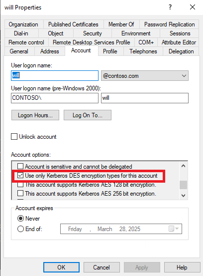

# DES Detection

Unlike some other ciphers within Kerberos, DES is not enabled by default and requires additional steps to be leveraged in an environment.

There are two parts of identification.

1. Which machines have enabled the DES ciphers as allowed encryption types?
2. Which accounts have DES keys?

## Identifying machines with the DES ciphers enabled

Starting with the first point, to leverage DES as a supported cipher, the DES needs to be enabled as an [allowed encryption type](https://learn.microsoft.com/en-us/previous-versions/windows/it-pro/windows-10/security/threat-protection/security-policy-settings/network-security-configure-encryption-types-allowed-for-kerberos) which is then propagated to the [`msDS-SupportedEncryptionTypes`](https://learn.microsoft.com/en-us/openspecs/windows_protocols/ms-kile/6cfc7b50-11ed-4b4d-846d-6f08f0812919).

Meaning, if we want to quickly identify machines that are capable of leveraging DES, then we only need to query the `msDS-SupportedEncryptionTypes` attribute.

```powershell
PS C:\tools> Get-ADObject -Filter 'msds-SupportedEncryptionTypes -band 0x3'

DistinguishedName                             Name ObjectClass ObjectGUID
-----------------                             ---- ----------- ----------
CN=D1,OU=Domain Controllers,DC=contoso,DC=com D1   computer    86ac39a8-ffeb-49b6-b56b-2b7e8e3b64bb
CN=D2,CN=Computers,DC=contoso,DC=com          D2   computer    2cfecd60-9dcb-4297-9622-36baad2dab7d
CN=D3,CN=Computers,DC=contoso,DC=com          D3   computer    b3a7ef73-5f17-4249-982b-3e9c1bf4b697
```

Then remediation is as simple as removing DES as an allowed encryption type using the same GPO listed above.


## Identifying accounts with DES keys

The second part of identification  the target account needs to have the User Access Control (UAC) bit for DES set to leverage DES keys.

Within the Active Directory User properties window, it looks like this:



Within the Active Directory database, this field is applied as a bitmask on the [UserAccountControl](https://learn.microsoft.com/en-us/windows/win32/adschema/a-useraccountcontrol) attribute:

```powershell
PS C:\tools> (Get-ADUser -Identity Will -Properties UserAccountControl)


DistinguishedName  : CN=will,CN=Users,DC=contoso,DC=com
Enabled            : True
GivenName          : will
Name               : will
ObjectClass        : user
ObjectGUID         : 94855577-97b3-43b7-9abb-073abec986b9
SamAccountName     : will
SID                : S-1-5-21-4137082171-629732546-3280593868-1106
Surname            :
UserAccountControl : 2163200
UserPrincipalName  : will@contoso.com


PS C:\tools> (Get-ADUser -Identity Will -Properties UserAccountControl).UserAccountControl.ToString("x")
210200
```

Where the bit is question is `0x00200000` aka [ADS_UF_USE_DES_KEY_ONLY](https://learn.microsoft.com/en-us/windows/win32/adschema/a-useraccountcontrol#:~:text=0x00200000,types%20for%20keys.).

Given this information, you can quickly determine which accounts are capable of using DES by querying for that bitmask and the removing it (ideally through the AD User interface).

